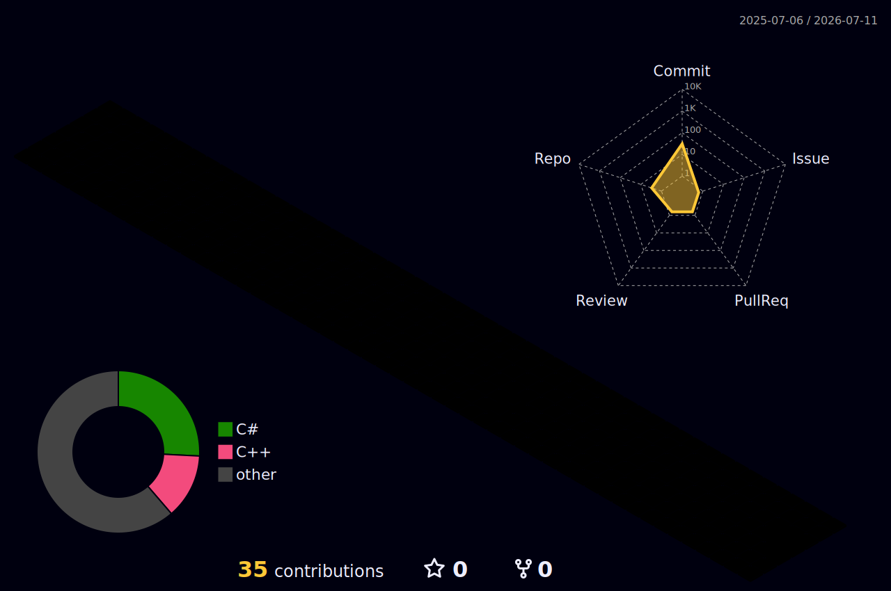

  

------

  

  <h2>
    
    About Me
  </h2>

  

    👋 Hi! I'm <b>Vũ Quang Vinh (Ivel Anrynne)</b>, an Information Technology student from Vietnam who enjoys turning ideas into real projects through code.  

    💻 <b>Currently focusing on:</b>
    <ul>
      <li><b>Programming:</b> C#, C++, SQL Server</li>
      <li><b>Development:</b> .NET, Git, GitHub</li>
      <li><b>Environment:</b> Visual Studio Code, Visual Studio, Linux (Ubuntu)</li>
      <li><b>Learning:</b> Backend Development, Data Structures & Algorithms, Clean Code</li>
    </ul>

    🌱 <b>My Goal:</b> Become a skilled Backend Developer by continuously building projects, improving problem-solving skills, and writing maintainable, efficient code.  

    ⚡ <b>Fun Fact:</b> I believe every project is another step toward becoming the developer I choose to be. 

    <i>"I am not who others think I am. I am who I choose to become."</i>
  

 

------

## 🌐 Socials:
    

# 💻 Tech Stack:
     
# 📊 GitHub Stats:
 
 

### ✍️ Random Dev Quote

---

<!-- Proudly created with GPRM ( https://gprm.itsvg.in ) -->

<h2 align="center">Building..</h2>

  

 
